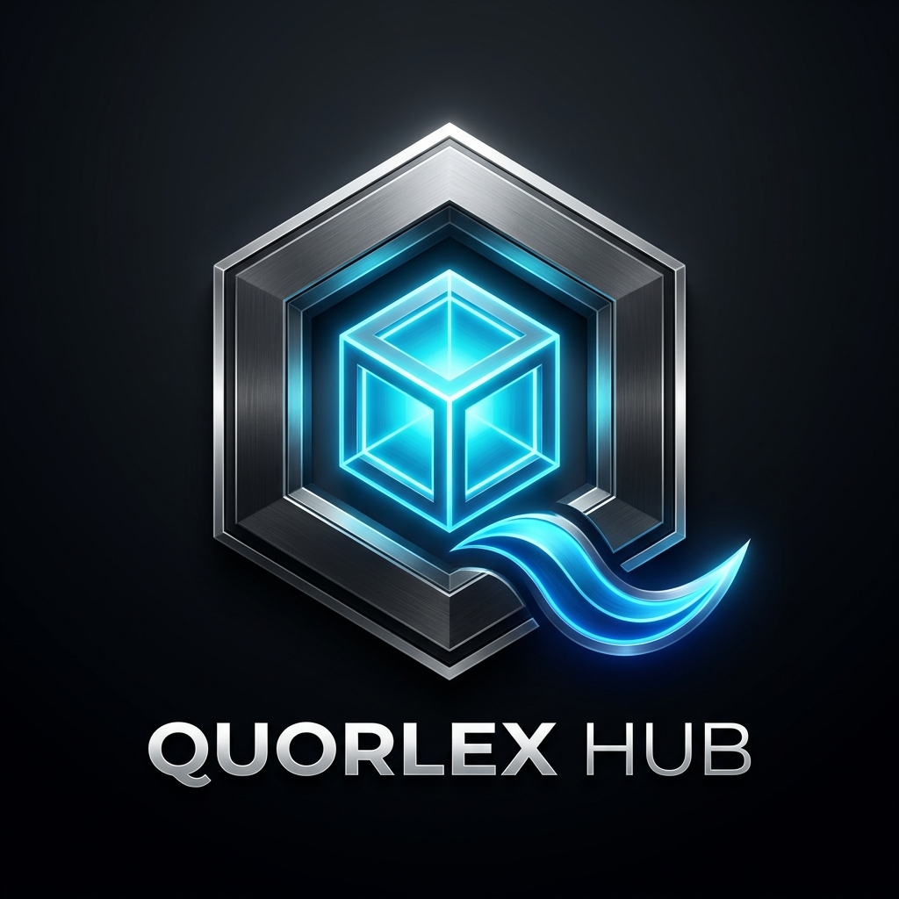

<div align="center">



# Quorlex Hub

**Official Digital Asset, Software, Minecraft Mod & Plugin Distribution Platform**

[](https://react.dev)
[](https://www.typescriptlang.org/)
[](https://tailwindcss.com/)
[](https://vitejs.dev)
[](https://firebase.google.com/)

</div>

---

## 🌟 Overview

**Quorlex Hub** is a full-featured, modern distribution platform built for creators, server administrators, game developers, and modders. It serves as a central marketplace and hub for sharing, discovering, and downloading high-quality digital assets, software, Minecraft mods, server plugins, shaders, and 3D models.

Engineered with React 19, TypeScript, Tailwind CSS, and Motion, Quorlex Hub delivers an ultra-fast, smooth, and interactive user experience paired with real-time statistics and community synchronization.

---

## ✨ Key Features

- 📦 **Asset & Mod Directory**:
  - Categorized browsing across **Mods**, **Plugins**, **Software**, **3D Assets**, and **Shaders**.
  - Advanced search, multi-tag filtering, and sorting (Most Popular, Latest, Highest Rated).
  - Detailed modal view with markdown descriptions, release tags, file size, target versions, and direct downloads.

- 📊 **Real-Time Live Analytics**:
  - Dynamic **Total Downloads** tracking calculated accurately across all hosted assets.
  - Automated **Bandwidth Served** counter computed dynamically based on download counts and asset sizes.
  - Live **Discord Server Widget** syncing real-time online members and total community size via official Discord API.

- 🚀 **Creator Submission Portal**:
  - Submit custom digital assets and mods directly through an intuitive modal workflow.
  - Set custom tags, version tags, categories, file sizes, image previews, and direct download links.

- 👤 **User Profiles & History**:
  - Local & persistent account authentication via Firebase Auth / Local Storage.
  - **Bookmarks & Favorites**: Save items to your personal collection for quick access.
  - **Download History**: Track past downloaded files with timestamps and direct re-download links.

- 💬 **Interactive Community**:
  - Star ratings & review submission system.
  - Interactive comment section on assets for support, feedback, and discussion.
  - Integrated Discord Community widget with server status indicator and one-click join link.

- 🎨 **Sleek Cyberpunk/Dark UI**:
  - Modern dark layout engineered with high-contrast slate and electric cyan accents.
  - Fluid micro-interactions and smooth page transitions powered by `motion`.
  - Responsive design optimized across mobile devices, tablets, and desktop displays.

---

## 🛠️ Tech Stack

| Domain | Technology |
| :--- | :--- |
| **Frontend Framework** | [React 19](https://react.dev/) + [TypeScript](https://www.typescriptlang.org/) |
| **Build Tool** | [Vite 6](https://vitejs.dev/) |
| **Styling & Design** | [Tailwind CSS v4](https://tailwindcss.com/) |
| **Animations** | [Motion (Framer Motion)](https://motion.dev/) |
| **Icons** | [Lucide React](https://lucide.dev/) |
| **Backend & Storage** | [Firebase Firestore](https://firebase.google.com/) & Local Persistence |
| **Realtime APIs** | Official Discord Guild Widget API |
| **FX & Celebration** | [Canvas Confetti](https://www.npmjs.com/package/canvas-confetti) |

---

## 🚀 Getting Started

Follow these steps to set up and run Quorlex Hub locally on your machine.

### Prerequisites

Ensure you have the following installed:
- [Node.js](https://nodejs.org/) (v18.0.0 or higher recommended)
- `npm` or `bun` package manager

### Installation

1. **Clone the repository:**
   ```bash
   git clone https://github.com/your-username/quorlex-hub.git
   cd quorlex-hub
   ```

2. **Install dependencies:**
   ```bash
   npm install
   ```

3. **Configure Environment Variables:**
   Copy `.env.example` to `.env.local` or `.env` and set your configuration variables if required:
   ```bash
   cp .env.example .env.local
   ```

4. **Run the development server:**
   ```bash
   npm run dev
   ```
   Open `http://localhost:3000` in your browser to view the application.

---

## 📜 Available Scripts

In the project directory, you can run:

- `npm run dev` — Starts the local Vite development server on port `3000`.
- `npm run build` — Compiles and builds the production-ready application output in `dist/`.
- `npm run preview` — Locally previews the built production assets.
- `npm run lint` — Runs TypeScript compiler check (`tsc --noEmit`) to ensure type safety.
- `npm run clean` — Removes previous build outputs (`dist/`).

---

## 📁 Project Structure

```
quorlex-hub/
├── public/                  # Static public assets & web redirects
├── src/
│   ├── assets/              # Logo images and graphic assets
│   ├── components/          # Reusable UI components
│   │   ├── Header.tsx       # Navigation bar & brand branding
│   │   ├── HeroSection.tsx  # Hero banner & global stats counter
│   │   ├── HubCard.tsx      # Individual asset/mod item card
│   │   ├── ItemModal.tsx    # Detailed asset modal with downloads & reviews
│   │   ├── DiscordWidget.tsx# Live Discord community sync widget
│   │   ├── SubmitModal.tsx  # Submission portal for new assets/mods
│   │   ├── AuthModal.tsx    # Sign in / Sign up modal
│   │   └── Footer.tsx       # Page footer & links
│   ├── context/             # React Context providers (Auth, Theme)
│   ├── data/                # Initial data, fallback assets & stats
│   ├── types.ts             # Global TypeScript interfaces & types
│   ├── App.tsx              # Main application root component
│   └── main.tsx             # Application entry point
├── firebase-blueprint.json  # Firebase database configuration schema
├── firestore.rules          # Firestore database security rules
├── index.html               # Main HTML entry file
├── package.json             # Dependencies and project scripts
├── tsconfig.json            # TypeScript configuration
└── vite.config.ts           # Vite configuration
```

---

## 🌐 Discord Widget Configuration

Quorlex Hub syncs live member stats directly from the official Discord API using your Discord Server ID.

To configure your own Discord server widget:
1. Enable **Enable Widget** in your Discord Server Settings (`Server Settings > Widget`).
2. Copy your **Server ID** (Guild ID).
3. The server ID can be updated in `localStorage` under `quorlex_discord_server_id` or directly configured in `src/components/DiscordWidget.tsx`.

---

## 📄 License

Distributed under the MIT License. See `LICENSE` for more information.

---

<div align="center">
  <sub>Built with ❤️ by the Quorlex Team & Community.</sub>
</div>
